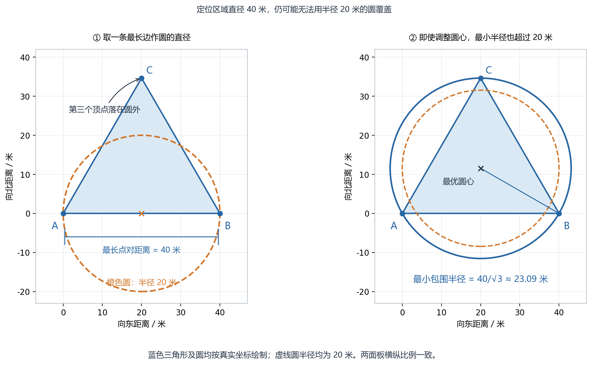
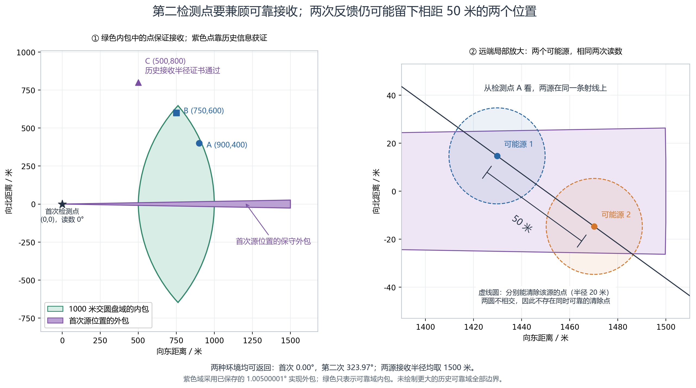

# 有界示向误差下的交会定位与第二检测点选择

本文为可供论文整合的模型正文草稿，尚未晋升为正式论文或 `src/` 结果。题面依据为 `problem/B题.md` 的问题 1、问题 2、附录 1—2，以及 `problem/附件2.md` 第 2.3—2.4 节。几何结论为自主推导，计算证据见文末索引；没有使用当届题解或官方隐藏数据。

## 1. 符号、观测与误差口径

考虑一个尚未清除的源，其位置为 \(s\in\mathbb R^2\)，有效接收半径为 \(R\)。记

\[
D=\{s:\|s\|\le1800\},\qquad 1000\le R\le1500,
\qquad B(c,r)=\{x:\|x-c\|\le r\}.
\]

第 \(i\) 次检测位置为 \(p_i\)，返回示向度为 \(\theta_i\)，从 \(p_i\) 指向 \(s\) 的真实方位角为 \(\alpha_i\)。角度差统一按圆周最短角度计算，避免 0° 与 360° 附近的不连续。符号约定如下。

| 符号 | 含义 | 单位 |
|---|---|---|
| \(s,p_i,q,c\) | 源、已有检测点、待选检测点、清除点 | 米 |
| \(\delta\) | 示向误差半宽 | 度；进入小角公式前转弧度 |
| \(W(p,\theta,\delta)\) | 前向误差扇形 | 位置集合 |
| \(P\) | 仅由示向扇形交会形成的区域 | 位置集合 |
| \(K,\widehat K\) | 相容位置集及包含它的凸多边形外包 | 位置集合 |
| \(d(A)\) | 集合直径 \(\sup_{x,y\in A}\|x-y\|\) | 米 |
| \(\rho(A)\) | 最小包围圆半径 | 米 |
| \(H\) | 同频道既往成功接收的检测点集合 | 点集 |

题面模型取 \(\delta=1^\circ\)：每个返回示向度相对真实方位的误差在 ±1° 内，返回值保留两位小数。同一地点误差固定，因此原地重复同频道读数不能按独立重复试验平均降噪；也不额外假定正态分布、零均值或各地点独立。

实现采用 \(\delta_{\rm impl}=1.00500001^\circ\) 的保守外包，以兼容“先加有界误差，再保留两位小数”的本地压力模型，并留微小浮点余量。**这是实现的外包余量，不能改写成官方误差为 ±1.005°。** 严格按接口返回误差 ±1° 理解时，实现范围更宽，仍包含全部允许真值，但可能多保留一些位置、增加动作数。后文解析结论取 1°；数值候选表明确取实现值。

全向源在检测点 \(p\) 的响应由距离决定：超过 \(R\) 为无信号，距源不超过 5 米为 `near`，其余为示向度。`near` 时可在当前点位执行清除。清除成功的距离阈值为 20 米，与源是否定向无关。

## 2. 问题一：误差扇形交会与区域直径

### 2.1 从示向度到半平面交

定义 \(u(\theta)=(\cos\theta,\sin\theta)\)，二维叉积为 \([a,b]=a_xb_y-a_yb_x\)。当 \(0<\delta<90^\circ\) 时，一次示向度对应

\[
W(p_i,\theta_i,\delta)=
\{s:[u(\theta_i-\delta),s-p_i]\ge0,
\ [u(\theta_i+\delta),s-p_i]\le0\}. \tag{1}
\]

式 (1) 是两条**射线方向**确定的前向扇形，已经排除了反向延长线。它可以跨过 0°，无需按角度区间另行分支。若研究零误差极限，须另加 \(u(\theta_i)\cdot(s-p_i)\ge0\)，以免两条重合边界被误当作整条直线。

将每次观测写为两个标准半平面，问题一的交会区域为

\[
P=\bigcap_{i=1}^{N}W(p_i,\theta_i,\delta)
 =\{s:a_k\cdot s\le b_k,\ k=1,\ldots,2N\}. \tag{2}
\]

若进一步使用目标域和成功接收距离上界，则可收紧为 \(P\cap D\cap_i B(p_i,1500)\)。此时边界一般包含圆弧，不能把它与式 (2) 的多边形混称为同一精确对象。实现中用圆盘的外接多边形形成 \(\widehat K\)，从而保持 \(K\subseteq\widehat K\)；求得的直径和包围半径作为真实区域相应尺度的上界。

### 2.2 适合少量观测的算法

设半平面数为 \(m\)。先将非零法向量单位化，并处理恒真或矛盾的零法向约束。随后按以下步骤计算。

1. 枚举两条不平行边界的交点，保留满足全部不等式的交点。
2. 判定可行性：除保留交点外，检查原点及原点在每条边界上的垂足。若全不可行，区域为空。该步骤覆盖没有顶点的半平面、条带等情形：非空闭凸多面集距原点最近的位置必为原点、边界垂足或边界交点。
3. 检查衰退锥 \(\mathcal R=\{v:a_k\cdot v\le0,\ \forall k\}\)。若含非零方向，区域无界，直径为无穷大。二维可检查各约束法向量的两个垂直方向；无约束时直接认定无界。
4. 对有界区域的交点去重并求凸包。单点按直径 0 处理，线段按端点距离处理；通常多边形枚举凸包顶点对取最远距离。

朴素实现的半平面交点检查为 \(O(m^3)\)，若凸包有 \(v\) 个顶点，则直径计算为 \(O(v^2)\)。该规模下优先采用易核验算法；观测很多时可换用半平面排序与旋转卡壳，但不改变空、退化和无界的判定要求。

**命题 1。** 对非空有界凸多边形 \(P=\operatorname{conv}\{v_1,\ldots,v_v\}\)，有

\[
d(P)=\max_{a,b}\|v_a-v_b\|. \tag{3}
\]

证明：若 \(x=\sum_a\lambda_av_a\)，由范数凸性，\(\|x-y\|\le\max_a\|v_a-y\|\)。再对 \(y\) 使用同一结论，得到任意点对距离不超过最远顶点对距离，反向不等式显然成立。

空区域必须报告观测与模型不相容，不能当作“直径为零，可以清除”。数值实现使用向外裁剪与距离余量，近乎平行、极小退化区域或超大平移时应保留诊断信息；用任意大包围框截断不能代替无界性判定。

### 2.3 直径圆不一定覆盖，可靠清除应检查包围圆

取边长 40 米的等边三角形

\[
A=(0,0),\quad B=(40,0),\quad C=(20,20\sqrt3).
\]

其直径为 40 米，但最小包围圆半径为 \(40/\sqrt3\approx23.0940\) 米。因此，以区域直径为直径的任何圆都无法覆盖该区域。若取某条最长边中点为圆心，第三顶点距圆心甚至为 \(20\sqrt3\approx34.6410\) 米。

该三角形可由题设的三个 ±1° 扇形精确形成：对每条逆时针边 \(a\to b\)，令 \(e=(b-a)/40\)，检测点取 \(p=a-1000e\)，示向度取边方位加 1°。扇形一侧给出三角形内侧半平面，另一侧容纳整个三角形，因为最偏顶点的偏角为 \(\arctan(20\sqrt3/1020)<2^\circ\)。三个扇形交集恰为该三角形。

**命题 2。** 已知相容位置集为 \(K\) 时，位置 \(c\) 可保证一次清除，当且仅当

\[
\sup_{s\in K}\|s-c\|\le20. \tag{4}
\]

若可自由选择清除点，则存在可靠点的充要条件是

\[
\rho(K)=\min_c\sup_{s\in K}\|s-c\|\le20. \tag{5}
\]

对凸多边形只需检查全部顶点。其最小包围圆由一个点、以两个点为直径端点，或三个非共线点的外接圆确定，可枚举候选圆并逐顶点验算。实际算法不必依赖圆心求解器必然最优：取得任意圆心后，重新取其到所有外包顶点的最大距离并向外加余量，只要验证半径小于 20 米，就足以保证安全清除。

图 1　等边三角形的边长及区域直径均为 40 米。左图以最长边为直径的橙色虚线圆漏掉第三个顶点；右图蓝色实线圆为最小包围圆，半径约 23.09 米，仍大于橙色虚线圆的 20 米。两面板均按真实坐标及等比例坐标轴绘制。[矢量图](figures/q1_q2/q1_diameter_and_cover.svg)

## 3. 问题二：可靠接收的第二点候选区域

设首次在 \(p\) 获得方向 \(\theta\)。位置的凸外包可取

\[
K_0=D\cap B(p,1500)\cap W(p,\theta,\delta). \tag{6}
\]

方向反馈还说明 \(\|s-p\|>5\)，式 (6) 不挖掉近场圆孔，只会扩大相容区域，保留安全性。下文以 \(K\) 表示所用外包，能够使用额外历史时继续收紧。

### 3.1 只用最小接收半径的候选域

对任意 \(s\in K\)，若 \(\|q-s\|\le1000\)，则源一定能在 \(q\) 被接收。因此有可靠候选域

\[
C_{1000}(K)=\bigcap_{s\in K}B(s,1000).
\]

若 \(K=\operatorname{conv}\{v_1,\ldots,v_v\}\)，则

\[
C_{1000}(K)=\bigcap_{j=1}^{v}B(v_j,1000). \tag{7}
\]

式 (7) 的顶点约束既必要又充分，证明同式 (3) 使用范数凸性。该域为凸集，非空等价于 \(\rho(K)\le1000\)。作图或搜索时，可用各圆盘的内接多边形求一个候选域内近似，最终再验算真实顶点距离。源位置外包和可靠点候选域内包必须区分。

### 3.2 利用成功接收提供的未知半径下界

成功检测并不只给出方位。若同一源已经在 \(H=\{p_1,\ldots,p_h\}\) 接收成功，则对每个相容位置 \(s\)，其真实固定半径满足

\[
R\ge L_H(s):=\max\{1000,\max_i\|s-p_i\|\}. \tag{8}
\]

由此得到更大的可靠候选域

\[
C_H(K)=\{q:\|q-s\|\le L_H(s),\ \forall s\in K\}
      =\bigcap_{s\in K}B(s,L_H(s)). \tag{9}
\]

显然 \(C_{1000}(K)\subseteq C_H(K)\)。式 (9) 相对于精确且半径下界可行的位置集合给出鲁棒接收条件；若 \(K\) 是外包，仍给出安全的充分域，可能过小。既往成功点本身一定可靠，但重复检测没有新角度信息，故选点时排除这种无收益动作。

不能只在原多边形顶点检查式 (9)，因为右侧也依赖 \(s\)。对给定 \(q\)，把无法由任何历史距离支配的残余位置保守写为

\[
U(q)=K\cap\bigcap_{p_i\in H}
\{s:\|q-s\|\ge\|p_i-s\|\}. \tag{10}
\]

平方展开得到线性约束

\[
(q-p_i)\cdot s\le\frac{\|q\|^2-\|p_i\|^2}{2}. \tag{11}
\]

**命题 3。** 若残余区域为空，或 \(U(q)\subseteq B(q,1000)\)，则 \(q\in C_H(K)\)。

证明：对残余外的 \(s\)，至少一个历史点满足 \(\|q-s\|<\|p_i-s\|\le R\)；残余内的 \(s\) 则由 \(\|q-s\|\le1000\le R\) 保证接收。两部分覆盖 \(K\)。

于是可将式 (11) 逐次裁剪，检查残余凸多边形顶点的距离。采用闭半平面会额外保留等距边界，导致证书有时较保守；证书未通过不等于必然无信号。实现用 \(z=s-q\) 改写为 \((q-p_i)\cdot z\le-\|q-p_i\|^2/2\)，减轻大坐标平方差消去；所有裁剪向外放宽，最后以小于 1000 米的余量检查。

严格扩大示例：首次 \(p=(0,0),\theta=0^\circ\) 时，\(q=(500,800)\) 不在式 (7) 的候选域内，但式 (10)—(11) 的证书通过。这是利用观测已含信息得到的扩大，没有修改接收半径下限。

## 4. 可靠域内的几何效果与移动代价

### 4.1 交会夹角用于解释，后测包围半径用于计算

给定候选源位置 \(s\)，记两次检测距离 \(r_1=\|s-p\|\)、\(r_2=\|s-q\|\)，两条测向线夹角为 \(\gamma\)。小角度线性化得到两条带状区域，交集面积近似为

\[
A_{\rm lin}\approx\frac{4r_1r_2\delta^2}{|\sin\gamma|},\qquad \delta\text{用弧度}. \tag{12}
\]

式 (12) 说明近乎平行或反平行都不利，距离固定时接近直角较好；但 \(s\) 尚未知，选择 \(q\) 也会改变距离，故不能把“与估计中心形成 90°”宣称为最优策略。

更直接的评价是枚举第二次可能示向度 \(\beta\)，形成

\[
K_2(q,\beta)=K\cap W(q,\beta,\delta),\qquad
J(q)=\sup_{\beta:K_2(q,\beta)\ne\varnothing}\rho(K_2(q,\beta)). \tag{13}
\]

需要时进一步交上 \(B(q,1500)\)；不交这个圆只会使评价更保守。`near` 分支由半径 5 米的圆覆盖。包围半径比面积更贴近式 (5) 的可靠清除条件。

为覆盖连续的返回角，将 \([0,360^\circ)\) 分为宽 \(h\) 的角度箱。用每箱中心 \(\bar\beta\) 及扩大半角 \(\delta+h/2\) 计算交集。任何箱内读数对应的扇形都包含于该扩大扇形，因此各交集覆盖圆半径的最大值 \(\overline J_h(q)\) 是式 (13) 的上界。这里是覆盖连续角度的分箱上界，不是只抽几个误差值后称其为最坏情况。

### 4.2 与费用共同筛选候选

从首次检测点 \(p\) 走到 \(q\) 并继续测同一频道的直接虚拟耗时为

\[
T_2(q)=\|q-p\|/5+5\quad\text{秒}. \tag{14}
\]

检测其他频道后再切回需加 1 秒；此式尚不包括之后靠近源和清除的费用。为避免用未经解释的常数混加米和秒，保存 \((\overline J_h(q),T_2(q))\) 的非支配点：指定可接受定位尺度时选移动较短者；若追求更小的最坏包围半径，则允许更长移动。多源总时间策略在此基础上进一步考虑后续测量、预计清除格和其他频道的顺序。

可执行流程为：形成位置外包；产生并验证式 (7) 或命题 3 的可靠点；剔除已在同地点检测过的同频道动作；用交会夹角、距离作廉价预筛，再以式 (13) 的上界与式 (14) 构成非支配候选；完成第二次检测后更新区域，满足式 (4) 时清除，否则继续补测或执行有限格清除。该流程不承诺两次观测必然达到 20 米精度。

### 4.3 已有候选数值，不作全局最优结论

首次位置为原点、示向度为 0°，实现半角取 1.00500001°。源圆盘采用 360 边外包，候选圆盘采用 128 边内包。有限网格及补充点筛出 55 个可靠候选，其中 24 个为移动与定位尺度非支配点。已有结果如下，未重新试验或搜索。

| 第二点 / 米 | 可靠依据 | 直接耗时 / 秒 | \(h=1^\circ\) 半径上界 / 米 | \(h=0.25^\circ\) 半径上界 / 米 |
|---|---|---:|---:|---:|
| (900,400) | 1000 米交圆盘 | 201.9772 | 66.0339 | 61.7114 |
| (750,600) | 1000 米交圆盘 | 197.0937 | 69.1651 | 61.7791 |
| (500,800) | 历史半径证书 | 193.6796 | 79.8859 | 70.4837 |

(900,400) 只是本批 1° 分箱评价最好的点，细分后与 (750,600) 的上界很接近，后者移动较短。有限候选、圆盘近似及分箱都会影响排名，因此这些数值支持选点机制可计算，不能证明连续空间全局最优，也不能仅因上界超过 20 米就断言两次观测必然不够。后一命题需要下面独立的不可区分环境证明。

## 5. 两次观测不能普遍保证随后一次 20 米清除

**命题 4。** 第一次在原点得到 0° 示向度后，无论第二检测点如何选择，均存在两个符合题面规则的全向单源环境，产生相同的两次反馈，但源间距离大于 40 米。因此，不能仅依据这两次检测，对全部允许环境保证随后一次 20 米清除。

证明：设第二点为任意有限 \(q=(q_x,q_y)\)，分情形构造。

**情形 A：\(\|q-(50,0)\|>1000\)。** 若 \(q_x\ge50\)，取两源位置 \((6,0),(50,0)\)；否则取 \((50,0),(100,0)\)。两环境半径均为 1000 米，首次均为非近场且真实方位 0°。所选另一个源均在远离 \(q\) 的一侧，故第二次都无信号，源间距离为 44 或 50 米。

**情形 B：\(\|q-(50,0)\|\le1000\)。** 令

\[
z=(1450,0),\quad d=\|z-q\|,\quad u=(z-q)/d,\quad
s_-=z-25u,\ s_+=z+25u. \tag{15}
\]

此时 \(d\ge400\)，且 \(|u_y|\le5/7\)、\(u_x\ge\sqrt{24}/7\)。两源均满足 \(x\ge1425\)、\(|y|\le125/7\)，首次方位绝对值至多

\[
\arctan\frac{125/7}{1425}<0.719^\circ.
\]

故两环境首次均可合法返回精确的 0.00°。两源距原点在 1425—1475 米之间，位于目标域内，相距 50 米。

若 \(d\le1475\)，两环境半径均取 1500 米；第二次距离为 \(d-25\)、\(d+25\)，均大于 5 且不超过 1500，两个源位于从 \(q\) 出发的同一射线上，故可返回相同的两位小数示向度。

若 \(d>1475\)，分别取两个环境半径 \(R_-=\|s_-\|\)、\(R_+=\|s_+\|\)，都在允许区间内，首次恰好接收。对 \(-25\le t\le25\)，令

\[
f(t)=d+t-\|z+tu\|.
\]

由 \(f'(t)=1-u\cdot(z+tu)/\|z+tu\|\ge0\)，且 \(\|z-25u\|<1450\)，得

\[
f(t)\ge f(-25)>1450-\|z-25u\|>0.
\]

于是第二次两源距离均超过各自的接收半径，反馈同为无信号。这里两个不可区分环境可以有不同的未知半径，这是题面允许的环境不确定性。

任一基于相同历史选择的清除点 \(c\)，若能同时可靠清除这两个环境，则三角不等式要求源间距不超过 \(20+20=40\) 米，与构造矛盾。各环境只须在已查询地点赋予上述误差，其他地点任取合法固定值；若第二点仍为原点，构造中两次方位均为 0°，同点固定误差条件也成立。证毕。

可复算例：当 \(q=(900,400)\) 时，取

\[
s_-=(1429.781598,14.704292),\quad
s_+=(1470.218402,-14.704292),\quad R_-=R_+=1500.
\]

首次真实角分别约为 0.589226°、−0.573021°，均可返回 0.00°；第二次真实角均约为 323.972627°，均可返回 323.97°，距离分别约 655.0735、705.0735 米。源间距 50 米，因此不存在共同的半径 20 米清除圆。

图 2　左图绿色多边形是针对已保存首次位置外包计算的 1000 米交圆盘域**内包**；紫色窄域为首次源位置**外包**，采用实现半角 1.00500001° 与圆盘外包。点 A、B 满足 1000 米可靠条件；点 C 依靠历史半径证书可靠，图中未绘制更大的历史可靠域完整边界。右图放大真实反例坐标，黑线为从 A 看两源的共同射线；蓝、橙虚线圆分别表示能清除对应源的点域，两圆无交集。此图未将示意区域冒充精确后验。[矢量图](figures/q1_q2/q2_reliable_region_and_ambiguity.svg)

两图由 `figures/q1_q2/plot_q1_q2.py` 生成，使用既有 `runs/q2/geometry_results.json`，没有重新搜索候选。实际绘图数值保存于 `plot_values.json`；原始数值、脚本与 PNG/SVG 的 SHA256 见同目录 `manifest.json`。

该命题既不否定某些环境两次就能定位成功，也不否定增加检测或多次格清除后全清。随机选点同样不能提供“每次随机实现都保证成功”的普遍断言；本文不讨论其对给定分布的成功概率。

## 6. 与全局算法的联系及固定误差场结论边界

问题一提供每个频道的保守位置外包与可靠清除判据；问题二提供保证接收的候选点与定位收益评价。问题三在多个频道间联合选择检测、接近和清除动作，发现与定位共享移动。对于全向源，无信号还说明真实位置不在该检测点的 1000 米闭圆盘内，可保守增加排除圆；问题四不能直接采用这条规则，因为近处阴性可能仅由背向发射造成。

Q4 的历史阳性仍给出式 (8) 的半径下界，但命题 3 在 Q4 中**只证明距离可接收**，还须验证发射半平面条件。当前联合状态按连续小格外包源位置与朝向；只有整格没有任何全向或定向解释时才删除。未知频道结束则另由连续覆盖证书保证，不能靠已发现源个数或零散阴性提前结束。

对于任意地点固定、但满足角度界的真实误差场，几何外包、可靠接收和可靠清除证明不需要独立同分布假设。有限后备阶段也不依赖误差的统计平均：首个方向给出长度 1500 米、宽 52.8 米的外包矩形，可用两行各 50 个格点覆盖，每格中心到角点距离 \(\sqrt{15^2+13.2^2}=19.98099<20\) 米。有限发现点加每源至多 100 次清除，配合动态阶段预算，提供全清闭环；成功前所有删区都须保留真源。

已单独核查的默认代码为 Q3 `CompletionCostPolicy` 及 Q4 `Q4DirectionalPolicy` 的 37 点后备。其条件性虚拟时间上界分别为 64410.48 秒与 110310.48 秒，已计动态预算及一次跨阈值动作、发现、接近、格清除和最终认证圆心跳跃；小于 100 小时。它们不是正常成绩估计，也不能直接把 37 点的数值界冒称为未单独逐行核对的 25 点组合界。现实 20 分钟尚无普遍端到端保证，实际还受接口响应和进入时剩余窗口限制。

### 固定场压力证据中的舍入边界

本地冻结环境先加 ±1° 原始误差，再将示向度保留两位小数，故返回误差可达 ±1.005°。首批轨迹依赖困难场 `runs/adversarial/fixed_field_75100/` 的 411 次方向反馈中，有 **165 次**最终误差绝对值大于 1°，最大为 **1.0049849537649607°**。这批全部完成且重放一致，但只能称作舍入扩展压力模型，不能冒称严格符合接口返回误差界，更不能称作官方误差分布。

发现该边界后，在保留首批的同时，将困难场生成器改为从五个原始误差候选中剔除舍入后超过 1° 的返回值。新目录 `runs/adversarial/strict_fixed_field_75100/` 保存同时满足原始误差与返回误差均在 ±1° 内的场与完整重放；具体全局结果见 `ADVERSARIAL.md`，不在本文将两种口径混合统计。采用 1.00500001° 外包的策略仍覆盖严格题面 ±1° 场，因此这个发现不推翻几何正确性，但要求修正实验的合法性标签和效率结论范围。

这些按查询轨迹构造后再冻结的场，只证明存在一组困难、可重放的固定误差环境。它们既不是官方分布样本，也不是所有固定误差场的穷举；成功不能估计稀有失效概率。完整算法的“确保全清”应依托保守删区和有限后备证明，“完成时间较短”则需明确案例、误差口径和实际接口证据，不能以局部面积改善或少量压力测试替代。

## 7. 可追溯依据与采用要求

| 本文内容 | 已有实现或证据 |
|---|---|
| 半平面分类、直径、三角形反例、接收证书、角箱上界 | `q2_geometry.py`、`test_q2_geometry.py`；16 项既有测试通过 |
| 55 个候选与细分上界、反例数值 | `runs/q2/geometry_results.json`；不重做候选搜索 |
| 对任意第二点的构造式与附加数值核对 | `Q1_Q2.md`、`universal_two_measurement_counterexample`；509 个边界/随机点仅作补充检查 |
| 默认动态预算和有限后备对应关系 | `FALLBACK_BOUND.md`、`runs/q2/fallback_bound_checks.json` |
| 连续位置—朝向联合删除 | `Q4_JOINT_STATE.md`、`q4_joint_state.py` |
| 固定困难场及严格重放、舍入口径修正 | `ADVERSARIAL.md`、`runs/adversarial/` |

上述为本地推导与 AI 自检证据，未声称团队人工审阅、官方演练或正式成绩。整合入论文时，保留题面误差界、实现余量、候选上界与不可行反例各自的性质，按仓库要求晋升采用代码、生成正式结果，并将官方测试结果另表呈现。
