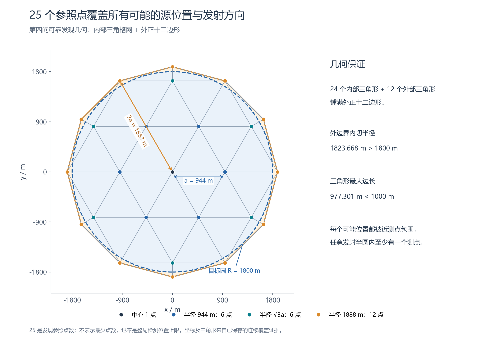
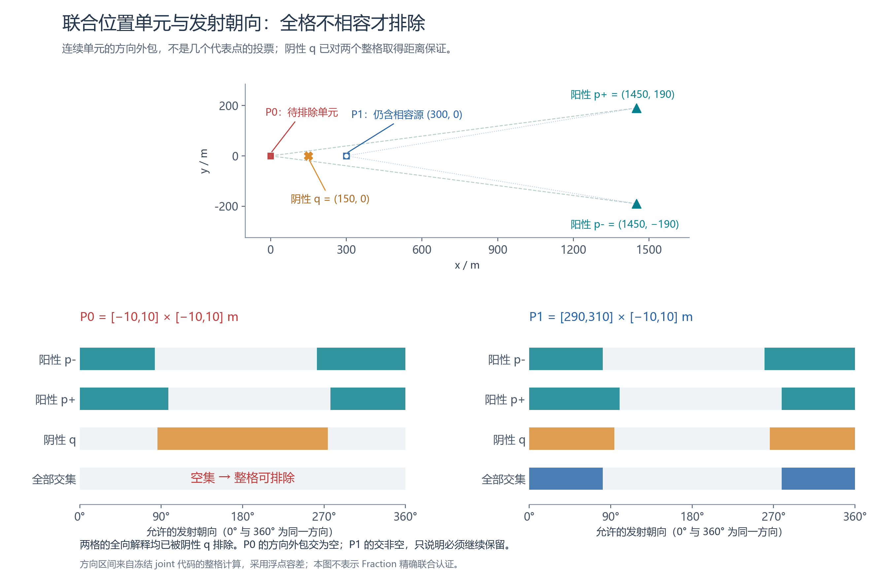

# 第四问模型说明：25 点可靠发现、联合几何排除与任务费用决策

本稿面向队友理解、复核和组织论文。对应当前本地最终候选 `joint25`，即 `Q4Symmetric25Policy + Q4JointCoverageInformationState + Q4Config()`。文中明确区分数学保证、决策启发式和自建环境实测；代码仍在 `experiments/`，尚未晋升为论文正式代码。

## 1. 第四问真正增加了什么困难

第三问的全向源在 1000 米内必能被接收，所以一次无信号可以排除一个圆盘。第四问存在半圆定向发射：即使离源很近，站在背面也可能无信号。**因此第四问不能直接沿用“阴性检测排除半径 1000 米圆盘”的规则。**

最终方法分别解决三件事：

| 任务 | 使用的方法 | 结论性质 |
|---|---|---|
| 未知频道究竟没有源，还是源藏在发射背面？ | 25 个参照点形成连续几何覆盖；阴性历史建立覆盖证书 | 有证明的不存在判据 |
| 已发现源的哪些位置仍可能？ | 联合位置单元、接收半径下界与连续发射方向外包 | 有证明依据的保守删格，浮点实现 |
| 下一步测量或清除怎样更省时间？ | 比较预计剩余清除工作和移动、测量费用 | 启发式排序，不是最优性证明 |

安全判断与效率排序分开：即使选点评分不准确，也不能据此删除可能位置或提前结束。可靠发现和有限格清除为自适应决策提供后备闭环。

## 2. 题设、隐藏量与可观测量

题设来源为 `problem/B题.md` 和 `problem/附件2.md`。源位置在半径 1800 米圆域内，总数为 10—16，频道互异且属于 1—20。每个源的接收半径在 1000—1500 米之间；定向源的发射角为包含边界的 180 度。源数、位置、半径、类型和定向角均不能直接读取。

| 符号 | 含义 | 单位/范围 |
|---|---|---|
| \(s_j\) | 频道 \(j\) 的源位置，若存在 | 米，\(\|s_j\|\le1800\) |
| \(R_j\) | 有效接收半径 | 米，\([1000,1500]\) |
| \(\phi_j\) | 定向源的发射朝向 | 度，按模 360 处理 |
| \(x_t,q_t\) | 当前机器狗位置、下一行动位置 | 米 |
| \(H_j^+,H_j^-\) | 该频道阳性、阴性测点历史 | 坐标集合 |
| \(P\) | 一个连续位置单元 | 凸多边形，也允许退化 |
| \(\Theta(P)\) | 单元内可能发射方向的外包 | 圆周角区间集合 |

若源全向，测点 \(q\) 接收的条件为 \(\|q-s_j\|\le R_j\)。若源定向，还须满足

\[
|\operatorname{wrap}(\arg(q-s_j)-\phi_j)|\le90^\circ.
\]

这里的 \(\arg(q-s_j)\) 是**源看向测点**的方向；测向机返回的示向度近似 \(\arg(s_j-q)\)，两者相反，不能混用。接收后距离不超过 5 米返回 `near`，其余返回示向度；接收条件不满足返回 `no_signal`。示向度原误差为 \(\pm1^\circ\)，实现额外容纳两位小数舍入，采用 \(1.00500001^\circ\) 的外包半角。

清除与发射方向无关：距源不超过 20 米即成功。移动速度为 5 米/秒；检测 5 秒，检测换频道另加 1 秒；清除成功 5 秒、失败 3 秒。清除不改变测向机频道。总费用为

\[
T=\sum_t\frac{\|q_t-x_t\|}{5}
+5N_{\rm measure}+N_{\rm switch}
+5N_{\rm clear,success}+3N_{\rm clear,fail}.
\]

要求先确保全部清除，再尽量减小 \(T\)。题面指标为单局 \(T/N_{\rm cleared}\)；全清时分母为该局真实源数。跨案例的“平均总秒数”和“逐局每源时间的均值”是不同指标，后文分别列出。

## 3. 25 点如何保证未知频道不被漏掉

### 3.1 构造

取 \(a=944\) 米。首先保留 19 个三角格点

\[
\mathcal P_{19}=\left\{a\left(i+\frac j2,\frac{\sqrt3j}{2}\right):i,j\in\mathbb Z,\ i^2+ij+j^2\le4\right\}.
\]

再增加极角 \(30^\circ+60^\circ k\)、半径 \(2a=1888\) 米的六点，\(k=0,\ldots,5\)。完整点集由中心 1 点、半径 \(a\) 的 6 点、半径 \(\sqrt3a\) 的 6 点、半径 \(2a\) 的 12 点组成。



**图 1 图注建议：**25 个发现参照点及其 36 个三角形构成的覆盖。外正十二边形严格包含半径 1800 米的目标域，所有三角形直径小于 1000 米，使任意源位置都可被有效接收距离内的测点包围。点位与三角形取自已保存的连续覆盖证据。

### 3.2 覆盖证明

19 个内点形成边长 \(2a\) 的六边形，可剖分成 24 个边长 \(a\) 的等边三角形。每条六边形外边已有中点，连接新增外凸点后，每边再形成两个三角形。因此 36 个三角形共同铺满外正十二边形。

外多边形内切半径与三角形最大边长为

\[
r_{\rm in}=2a\cos15^\circ=1823.667960\ldots>1800,
\]
\[
L_{\max}=4a\sin15^\circ=977.300714\ldots<1000.
\]

若源在三角形内部，三个顶点均距源小于 1000 米，并严格包围它。若源在剖分边或内部顶点上，使用所有相邻三角形的顶点，仍得到近距离内的严格包围。目标闭圆与外多边形边界存在正距离，因此没有只被单侧包围的边界位置。

被近测点严格包围的源，无论发射半圆朝向哪里，总有至少一个测点落在发射半圆内并满足距离条件。由此得到：

> **命题 1：**对任一未知频道，若这 25 个参照点均返回无信号，则半径 1800 米目标域中不存在该频道的全向或半圆定向源。

这证明点集有效，**没有证明 25 是最少点数、路线最短或整局时间最优**。定位阶段还会使用其他位置，所以 25 也不是整局检测位置上限；同一点的不同频道检测分别计次计费。

### 3.3 在线终止不依赖固定计数

实际状态按每个频道的阴性历史构造保守四叉树。一个方格仅当全部在源域外，或全部严格位于若干近阴性点的凸包内部时才删除；否则继续细分或保留未决。近测点要求方格四角到这些点均严格小于 1000 米。距离凸性和凸包性质使这个角点判据覆盖整个方格。

最后使用 `Fraction` 把实际存储数转成精确有理数，独立复核距离、凸包严格包含和完整四叉树划分。新 25 点证书包含 1816 个叶格、零未决、最深 8 层。自适应过程中已有的其他阴性点也可参加证明，而不是必须机械走完固定清单。

此外，若已经实际见到 16 个互异频道的源，则由总源数上界，其他未知频道可直接判不存在。原 37 点可靠发现方案仍作为后备保留。

## 4. 已发现源：位置单元与发射朝向联合排除

### 4.1 先保留包含真源的位置外包

首次阳性示向度产生一个带误差的有向扇形，并结合距测点不超过 1500 米、源域半径 1800 米形成位置外包。以后每次阳性再与相应扇形和距离外包相交；`near` 可缩到测点周围 5 米。

首次扇形包含在长 1500 米、半宽 26.4 米的条带内，因为

\[
1500\sin(1.00500001^\circ)<26.4.
\]

将条带分成两行、每行 50 个 \(30\times26.4\) 米小格。每格与现有凸位置外包相交得到 \(P\)。格子是连续多边形，不把格中心视为源的唯一可能位置。

### 4.2 阴性什么时候可以限制发射朝向

阳性点 \(p\) 至少说明 \(R_j\ge\|p-s_j\|\)。因此对给定可能位置 \(s\)，历史给出的接收半径下界为

\[
R_{\min}(s)=\max\left\{1000,\max_{p\in H_j^+}\|p-s\|\right\}.
\]

若能证明对**整个单元** \(P\) 都有

\[
\|q-s\|\le R_{\min}(s),\quad \forall s\in P,
\]

则阴性测点 \(q\) 的无信号不能由距离解释：该单元中的全向源解释被排除，定向源必须朝向背离 \(q\) 的半圆。实现通过历史距离的半平面残余裁剪证明这个关系，不只检查格中心。超过 1000 米的阴性也可能因已有阳性距离而成为可靠证据。

### 4.3 连续方向外包与整格删除

定义源看向测点的所有可能视线角

\[
A_q(P)=\{\arg(q-s):s\in P,\ s\ne q\}.
\]

观察点在凸格外时，连续视角由顶点极射线确定；观察点在格内、边上或极近边界时保守退回整圆。阳性、具有整格距离证据的阴性，分别给出允许方向外包

\[
\Theta_p^+(P)=A_p(P)\oplus[-90^\circ,90^\circ],
\]
\[
\Theta_q^-(P)=\bigl(A_q(P)+180^\circ\bigr)\oplus[-90^\circ,90^\circ].
\]

\(\oplus\) 表示角度扩张，所有运算按圆周处理。实现对边界向外加 \(10^{-6}\) 度，并保留闭端点；对真实阴性的严格边界要求作放松，只会多保留临界方向。

把各次允许方向求交得到 \(\Theta(P)\)。各次外包允许源位置在格内分别变化，是对真实联合可行集的放松，因此得到：

> **命题 2：**若全向解释已由可靠距离阴性排除，且 \(\Theta(P)=\varnothing\)，则整格不存在相容的源位置、类型和发射方向，可以删除。

反之，\(\Theta(P)\ne\varnothing\) 只说明这个充分判据还不能排除，不能据此宣称存在某个共同可行源。证明空的格可持久删除，因为首次格框不变，之后的位置约束只会继续收紧。



**图 2 图注建议：**对阳性测点 \((1450,\pm190)\) 和阴性测点 \((150,0)\)，单元 \(P_0=[-10,10]^2\) 的允许方向交为空，可以整格排除；\(P_1=[290,310]\times[-10,10]\) 的交非空，必须保留。\((300,0)\)、朝向东、半径 1500 米是后者的相容源实例。图中方向条带来自冻结代码的连续整格外包计算，**不是 Fraction 精确联合认证**。

joint 的几何依据是保守的连续外包，数值实现采用浮点裁剪、三角函数和容差。它与未知频道覆盖证书的有理数独立复核属于不同实现层次，论文中不能混写。

## 5. 下一步怎样选择：明确属于启发式的部分

### 5.1 预计剩余清除工作

对已发现源，令 \(N(P)\) 为保留格数，\(L(P)\) 为按条带投影估计的两行清扫长度。实现采用秒单位代理

\[
W(P)=5+\frac12\left[3\max\{N(P)-1,0\}+\frac{L(P)}5\right].
\]

若可能区域已有半径小于 20 米的包围圆，则令 \(W(P)=5\)。式中的“一半清扫”是排序近似，不是假设真实源均匀分布后推导出的严格期望，也不是时间上界。

对候选测点 \(q\)，在当前相容区域中取有限代表位置，并尝试 \(-1,0,1\) 度示向误差，计算测后 \(W\) 的下降，得到 \(\Delta W_j(q)\)。第四问再按代表位置上可行发射角的接收比例调整这个收益；全向与定向类型都仍可行时用等权组合。有限误差、代表点和类型权重都只用于打分，不参与删格或终止证明。

### 5.2 测量后清除与直接扫格的费用比较

设当前机器狗位置为 \(x\)，位置外包中心为 \(c_j\)，当前频道为 \(h\)。对一个已发现目标，比较两种计划：

\[
C_{\rm clear}\approx\frac{\|x-q_{\rm cell}\|}{5}+W(P_j),
\]
\[
C_{\rm measure}(q)\approx
\frac{\|x-q\|}{5}+5+\mathbf1_{j\ne h}
+\frac{\|q-c_j\|}{5}
+\max\{5,W(P_j)-\Delta W_j(q)\}.
\]

前者先走到一个可清除格，后者先测再接近当前区域中心。它们用当前中心近似测后接近目标的路程，故仍是启发式。候选包含位置中心、侧向交会点、接近点、既往接收侧的插值点和发现参照点。所有候选最终只执行一步，然后用新反馈重算。

未知发现阶段，每个尚未测过的 25 点参照赋予 30 秒的固定价值，用“多个频道的总价值 / 共享移动与检测费用”排序；30 秒是策略设计参数，不是已经证明可以节省的时间。当前位置若有某频道的估计收益至少达到本次检测和换频费用的 1.2 倍，优先做无需额外移动的共享检测。`near` 则优先清除。

## 6. 总体算法与有限后备

每个频道维护未知、已发现、不存在、已清除四种状态。完整流程为：

1. 依据上一次响应更新位置外包、阴性历史、joint 保留格与频道状态。
2. 若所有频道已不存在或已清除，则结束。
3. 若已进入后备，或累计达到 12000 虚拟秒/1000 动作，则执行有限后备；后备启动后不重新进入自适应。
4. 否则优先处理 `near`，再考虑当前位置共享检测；没有已发现源时做发现评分，有已发现源时比较本段完成费用。
5. 仅执行选出的一个检测或清除动作，再回到第 1 步。

后备按实际继承链依次补 25 点、必要时补原 37 点，直到未知频道消失，再完成已发现源的条带清除。不会把第四问退回第三问的单次阴性圆盘排除。

每个 \(30\times26.4\) 米格的中心到角点距离为

\[
\sqrt{15^2+13.2^2}=19.980990966\ldots<20.
\]

所以一次失败清除能排除至少本格；真实源所在格若仍保守保留，至多 100 次格清除尝试必能成功。joint 只安全跳过不可能格，不改变这一结论。区域缩小时也可转向认证包围圆心直接清除。

在默认配置、半径 5000 米行动域和有效反馈前提下，把自适应跨预算一次动作、25 与 37 两段发现、16 源接近及逐格清除全部计满，可得保守虚拟时间上界 **132813 秒，约 36.90 小时**，低于 100 小时；动作数上界 3840，低于本地驱动的 5000 次保护。完整推导与代码锚点见 `FINAL_Q4_REVIEW.md`。

这个界不证明现实 20 分钟内一定完成。本地规划、HTTP、官方模拟器延迟及实际剩余窗口要另行核验；循环间的现实超时检查也不是可抢占单次计算的硬时限。

## 7. 当前实测支持到什么程度

以下是主任务已保存的 12 个共同自建案例（种子 45100—45111），每种策略覆盖相同的 153 个源，布局包括均匀、边缘、聚簇和近共线，另有不同误差场与发射方向。三组均 12/12 全清。真值仅在环境与审计器中使用，策略只读公开历史。

| 策略 | 平均总时间，秒 | 逐局每源时间均值，秒/源 | 最慢局，秒 | 失败清除次数合计 | 平均检测位置数 |
|---|---:|---:|---:|---:|---:|
| 原 37 点方向策略 | 9568.24 | 790.21 | 12266.01 | 220 | 53.42 |
| 25 点 + 原已知源状态 | 6723.77 | 548.70 | 8260.87 | 215 | 40.83 |
| **25 点 + joint 联合状态** | **6620.61** | **540.94** | **7664.48** | **22** | **42.25** |

相对原方向策略，最终组平均总时间约减少 **30.81%**；12 局中 11 局更快、1 局更慢。失败清除由 220 次降为 22 次，但这些失败费用全部计入了总时间。joint 加入后平均检测位置略增，说明提速不能简单解释为“所有操作都减少”。最终组实际每局有 **29—56 个检测位置、144—346 次检测**，再次说明 25 不是总检测位置上界。

这只是本批新种子比较的观察结果，不是官方成绩，不代表未知官方分布的一般提速保证或稀有失效概率。本批已经被查看，后续不能再当作未见验证集。全清保证来自前面的几何和有限后备论证；这 12 局主要用于判断效率。

原始结果、全部动作、配置和匹配源码快照在 `runs/q4_integrated_validation/`，汇总口径见其中 `COMPARISON.md`。最终源码复核见 `FINAL_Q4_REVIEW.md`，包括已知的数值与现实限时边界。

## 8. 给论文写作的建议结构与表述边界

可以依次组织为：第四问观测模型 → 方向无关的 25 点可靠发现命题 → 连续位置—方向联合外包与删格命题 → 秒单位任务费用启发式 → 有限后备与全清论证 → 自建实验比较及官方演练另表。数学命题、参数设计和实验观察分别给出处与条件。

| 可以写 | 不应写 |
|---|---|
| 提出并验证一个有连续覆盖保证的 25 点发现设计 | 证明了最优 25 点或全局最短搜索路径 |
| 阴性历史能形成未知频道的连续不存在证书 | 第四问每次阴性都排除 1000 米圆盘 |
| 仅在整格的全向与定向解释均不相容时删格 | 用格中心/几个代表点判断该格不存在源 |
| 秒单位启发式用于选择测量与清除行动 | 已求得最优后验期望时间或最优控制策略 |
| 未知频道覆盖证书经过 Fraction 独立复核 | 所有 joint 几何与浮点计算均为精确有理认证 |
| 12 个共同自建案例平均总时间减少约 30.81% | 官方性能普遍提高 30.81%，或一般失效率为零 |

## 9. 实现与制图入口

| 文件 | 作用 |
|---|---|
| `q4_anchor_design.py` | 25 点常量、策略与几何证据生成 |
| `q4_coverage.py` | 未知频道连续覆盖与有理数证书 |
| `q4_joint_state.py` | 已发现源的连续位置—方向联合删格 |
| `task_cost.py`、`q4.py` | 预计剩余工作、动作评分与方向接收启发式 |
| `q4_compare.py`、`q4run.py` | 最终组合入口、共同场景、计费与真值审计 |
| `plot_q4_model.py` | 两幅方法图的生成脚本，兼容 Python 3.7 / matplotlib 2.2.3 |
| `figures/q4_model/` | 独立 PNG、SVG、joint 示例数据与图形清单 |

图 1 的点和三角形直接读取 `runs/q4_anchor_design/symmetric25_geometry/symmetric25_geometry.json`。图 2 读取由冻结 joint 代码生成的 `joint_example.json`。两图均使用微软雅黑；SVG 已将字体转成路径，便于跨电脑查看。已逐张检查 PNG，中文与标签正常，没有用生成式图像替代几何制图。

在项目根目录运行：

```powershell
D:/anaconda/python.exe experiments/b_overnight/plot_q4_model.py
```

脚本会先用 `py -3.13` 检查本轮 guard，再将 `MPLCONFIGDIR` 设为 night 内受忽略的 `.cache/matplotlib_q4/`。输入 SHA-256、绘图版本和脚本哈希保存在 `figures/q4_model/figure_manifest.json`。没有安装依赖，没有修改冻结求解代码。
