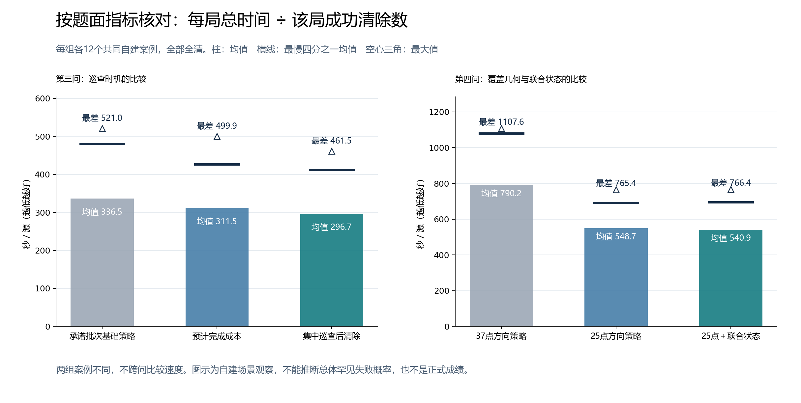

# 夜间研究：当前应保留什么

**已经形成可执行、能在官方演练全清的共同方法链。** 第三问保留“按预计完成成本选择下一动作”的 Completion 主体，并保留先集中巡查的 Sweep 候选；围绕巡查反例已试过两个改进方向，均未胜出，当前暂停。第四问采用有覆盖证明的 25 点发现网络与位置—朝向联合判断。两问共享保守信息状态、公开反馈驱动、接续已有状态的有限清除流程，没有拆成两套互不相容的解法。

## 已经跑到官方演练

2026-09-11 凌晨，实际核对官方当前界面为演练后分别运行。结束界面显示的源数，与公开成功清除回执中的不同频道数逐项一致。三次均正常 `/exit`，无重试、无计费冲突，运行期间依赖源码散列未变。下面现实时间是客户端从开始会话到结束的墙钟，包含enter/exit，不冒充官方单独公布的精确计时。

| 问题与方法 | 清除/官方源数 | 虚拟总秒 | 平均每源秒 | 客户端实测秒 | 检测位置/次数 |
|---|---:|---:|---:|---:|---:|
| Q3 Completion | 12/12 | 4206.73 | 350.56 | 3.64 | 22/174 |
| Q4 联合状态 + 25 点网络 | 12/12（全向7、定向5） | 7745.54 | 645.46 | 5.74 | 47/270 |
| Q3 集中巡查后清除 | 11/11 | 4197.60 | 381.60 | 1.73 | 17/118 |

证据：[核验结果](runs/official_practice/verified_results.json)，由 `verify_official_practice.py` 合并当前 UI 核验与公开回执生成。私有原始记录在 `practice/local_runs/`，截图在 `practice/local_evidence/`；不提交身份信息。**这是三次不同案例的单局演练，不能当正式成绩、总体稳健性证明或不同策略的公平对比。**

## 第三问：用更强的参照重新判断收益

此前基础策略会规划多频道批次，却可能只执行第一个频道就离开。修正这一点后，比较对象明显变强；不能把原先相对旧实现的较大收益全部归因于新模型。

新案例 94100—94111，四类布局、三种固定误差场，每种策略全部完成：

| 方法 | 每源平均秒 | 每源最慢四分之一均值 | 每源最慢秒 | 平均总秒（辅助） |
|---|---:|---:|---:|---:|
| 承诺执行批次的基础策略 | 326.09 | 450.57 | 467.05 | 3991.50 |
| Completion 默认参数 | 316.02 | 419.04 | 473.03 | 3859.10 |
| 筛选后的参数 | 320.38 | 431.50 | 465.16 | 3911.00 |

默认 Completion 相对强参照的每源均值快约 3.09%，本批每源尾部快约 7.00%，但各赢六例，每源最大值还略差。保留它主要因为平均、尾部表现与方法完整性；基础策略计算更省，应继续保留。总时间的均值/尾部改善分别为3.32%/11.85%，与每源口径不同，不能混写。见 [批次履行与归因修正](BATCH_COMMITMENT.md)、[题面指标重算](SCORECARD.md)。

新的“集中巡查后清除”沿同一条主线形成候选：另 12 个新案例中，相对 Completion **9 快 3 慢，平均快 4.78%，平均检测位置 24.92→20.00**；仍有一例慢 968.16 秒。见 [完整结果及机制](SWEEP.md)。Q3 DetourSweep 的途中插入把该反例减少 227.16 秒，但四个新布局相对原 Sweep 一快三慢，辅助总时间均值反增 7.35%，故暂停。原反例、完整账本和修补后新反例均在 [SWEEP_COUNTEREXAMPLE.md](SWEEP_COUNTEREXAMPLE.md)；原 Sweep 仍为候选，未宣布全面替代 Completion。

两轮离线配置搜索已经实现，但首代与二代在新的 24 个案例上均没有有意义的均值优势，二代最慢局还变差。故当前不采用调参胜出者，不继续围绕参数做大量消融。

## 第四问：主要进展来自几何和信息表达

独立种子 45100—45111，共 12 案例、每策略 153 个源全部清除：

| 方法 | 每源平均秒 | 每源最慢四分之一均值 | 每源最慢秒 | 平均总秒（辅助） | 失败清除总次数 |
|---|---:|---:|---:|---:|---:|
| 原 37 点方向策略 | 790.21 | 1079.08 | 1107.59 | 9568.24 | 220 |
| 对称 25 点网络 | 548.70 | 691.83 | 765.42 | 6723.77 | 215 |
| 25 点 + 位置—朝向联合状态 | 540.94 | 695.63 | 766.45 | 6620.61 | 22 |

相对原 37 点策略，联合方案本批每源均值快约31.54%，每源尾部快约35.53%；12例中有1例略慢。总秒口径的均值/尾部改善另为30.81%/33.84%。相对“仅25点”，联合判断虽然减少大量失败清除、每源均值也更好，但每源尾部和最大值略差，不能说全面占优。25 点来自本题的几何构造和连续证书，不来自论文规定点数，也没有证明最少必须 25 点。25 是发现参考点数；局部定位仍会补点，此批实际 29—56 个检测位置，官方这一局是 47 个。

联合状态利用“位置放在这里时，有没有任何一种固定发射方向能解释所有阳性与阴性”。只有整个小格都不可能时才删除，减少盲试清除。未知频道覆盖证书使用 Fraction 复核；联合朝向外包使用浮点及保守余量，不能把两者统称精确有理证明。见 [几何](Q4_ANCHOR_DESIGN.md)、[联合状态](Q4_JOINT_STATE.md)、[独立审查](FINAL_Q4_REVIEW.md)。

Q4 集中巡查在另 12 例中各赢六例，每源均值和尾部均不如动态联合方案，但每源最大值略好（698.04 vs 706.30秒）。虽然检测位置更少，仍不足以替换默认。

随后 Q4 TourSweep 优化剩余发现点的开放路线，在四个新布局相对原 Sweep 两快两慢，每源均值从 635.64 升至 636.84 秒，发现移动路程四局均未缩短。每源最大值虽略好，圆边朝外案例仍比 joint25 多 886.06 总秒，故同样暂停；见 [TOUR_SWEEP.md](TOUR_SWEEP.md)。该模块的 Q3 类只有实现，没有另跑 Q3 整局，不能据此宣称 Q3 提速。

固定联合 25 点主线后，另做主动空间与朝向困难搜索：**14 次联合方案与 2 次原 37 点对照全部全清、无后备，全部审计通过**。最大已找到题面成本为 **784.57 秒/源**（10 源边缘朝外加朝向扰动），同案例原 37 点为 1189.55 秒/源；次难例分别为 782.50 与 1175.78 秒/源。总时间最大的却是另一 16 源案例，8597.97 总秒、537.37 秒/源，不能混称为每源最坏。本轮固定零误差场，只针对合法空间与朝向做有限搜索，不能推断概率或全局最坏界；全部案例、动作及谱系见 [WORST_CASE_SEARCH.md](WORST_CASE_SEARCH.md)。

## 试过的其他方向

| 方向 | 已执行的方法 | 当前结论与入口 |
|---|---|---|
| 连续覆盖终止 | 阴性测点并集覆盖与有理数证书 | 保留，特别用于新 Q4 网络；COVERAGE.md、Q4_COVERAGE.md |
| 更充分利用接收半径 | 阳性历史构造保证接收域；阳性与阴性导出线性排除 | 数学信息保留，当前策略未明显提速；reception.py、range_state.py |
| 直接工作量收益/费用 | 把面积收益换成预计清除工作下降 | 初版更慢，推进为 Completion 后才有效；TASK_COST.md |
| 多目标共享定位收益 | 移动点评分同时计入其他频道节省工作 | 12 例均值持平、尾部较好，未替换；shared_completion.py |
| 近距离中心细化 | 先接近可能区域中心，再测向/清除 | 12 例3快9慢，计算很省；center_refinement.py |
| 任务路线费用 | 距离与清除顺序进入任务排序 | 四例两快两慢，聚集例退化；ROUTE_COST.md |
| Q3 DetourSweep | 在发现路线途中插入测量与可靠清除 | 已知反例缓解，新四例一快三慢，暂停；[反例与完整账本](SWEEP_COUNTEREXAMPLE.md) |
| Q4 TourSweep | 优化剩余发现点的开放路线 | 新四例两快两慢、每源均值略差，发现路程无改善，暂停；[路线与反例](TOUR_SWEEP.md) |
| 前瞻模拟 | 历史相容环境、共同完整轮次、短段后有限完成、完整 Completion 后续 | 即使计算充分也无稳定收益，暂停；ROLLOUT.md |
| 离线规则迭代 | 共同案例逐轮淘汰、精英扰动与少量全局探索 | 两轮实现，未得到稳定更优参数；configure.py |
| Q4 角度/包围收益 | 用剩余方位与包围缺口选择点 | 两种启发式均慢，暂停；Q4_SEARCH.md |
| 网络压缩 | 37→31，再构造25；Q3 1200环→1130环 | 25保留；Q3收益小且裕量变窄，不换默认；Q3_ANCHOR_DESIGN.md |

## 可靠性已经做到哪一步

1. 保守状态不使用真实隐藏位置；真值只用于本地环境与逐动作审计。确定性覆盖与有限清除可解释为何不会因启发式选点不佳而永久遗漏。
2. 边界压力案例和专门构造的困难固定误差场已执行。严格 ±1° 困难场 Q3/Q4 各四局，104 个源全清；八次固定场重放轨迹一致，没有误删。详见 [ADVERSARIAL.md](ADVERSARIAL.md)。
3. 本地基础环境先施加 ±1° 再保留两位小数，可能产生至多约 ±1.005° 的返回误差。这是较宽的压力模型，不是严格官方分布。困难场后来另做了严格返回误差不超过 1° 的一批；两批明确分开，原始记录保留。策略使用 1.005° 余量仍覆盖官方 ±1°。
4. 实际联合 25 点策略的最宽松有限后备界约 **36.90 虚拟小时、3840 动作**，低于 100 小时；Q3 默认约 17.89 小时。证明依赖几何与协议正常执行。现实 20 分钟没有数学硬保证，但当前实测远低于该限时，官方驱动有退出预留。

统计已按题面口径复核：先逐局计算“总时间/清除数”，再跨案例求均值和尾部。[SCORECARD.md](SCORECARD.md) 保存主指标和辅助总时间。两轮历史参数搜索用的是总时间；保留原快照，未来配置入口默认改为每源时间，没有为改统计口径再跑一轮搜索。

目前不能声称“极差表现只有极小概率”：本地分布是自建的，案例数量有限，且查看过的数据不能再当未见验证。现有证据支持继续推进、接入演练和整理候选论文模型；最终定案与晋升 `src/` 仍需团队人工审阅。
