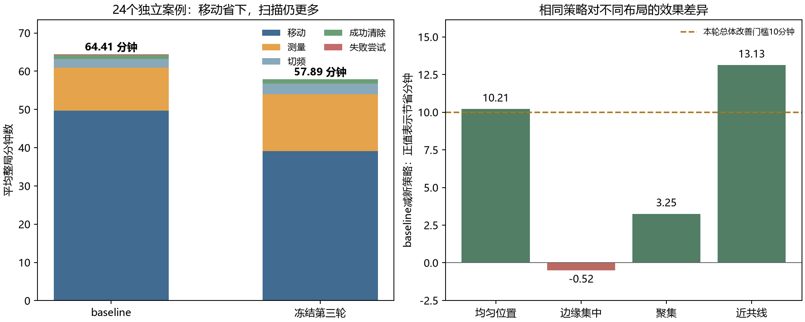
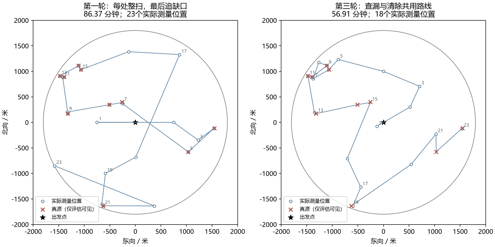

# 本轮结论：有局部价值，未达到替换baseline的目标

**本轮不推荐用新方案替换baseline。** 已完成四轮、8个候选版本，以及冻结版本的24个独立新案例和8个压力案例。
最好的第三轮版本在独立新案例中把平均64.41分钟降到57.89分钟，节省6.52分钟；压力案例平均反而慢0.27分钟。
全部案例都全清，但没有达到“平均省至少10分钟、整局40–50分钟”的要求。第四轮明确修正未改善，已经停止新增候选和调参。

这是否定本轮实现达到预期，不是证明“两点起搜+途中补测”在任何设计下都无效。

## 1. 最终独立结果

| 冻结后同案比较 | baseline | 本轮最好版本R3 | 变化 |
|---|---:|---:|---:|
| 24新案例平均整局/分钟 | 64.41 | 57.89 | 省6.52分钟 |
| 逐局T/N后取平均/秒 | 298.52 | 269.93 | 省28.59秒/源 |
| 全清案例数 | 24/24 | 24/24 | 全部全清 |
| 最慢案例整局/分钟 | 80.39 | 87.81 | 新版最慢更差 |
| 8压力案例平均整局/分钟 | 62.91 | 63.17 | 新版慢0.27分钟 |
| 压力案例全清 | 8/8 | 8/8 | 全部全清 |

24例中18例改善、6例退步。按四种布局各占四分之一的实验设计，配对分层bootstrap的95%经验区间为节省4.26–9.04分钟。
另一个独立、不分层的配对bootstrap得到3.40–9.85分钟，判断一致。两者的重采样口径不同，不能当成两批独立试验；均不代表官方分布或最坏情形保证。

| 新案例布局，每类6例 | baseline/分钟 | R3/分钟 | 节省/分钟 |
|---|---:|---:|---:|
| 均匀位置 | 67.89 | 57.68 | 10.21 |
| 边缘集中、接收半径1000米 | 79.14 | 79.66 | -0.52 |
| 聚集 | 49.17 | 45.92 | 3.25 |
| 近共线 | 61.45 | 48.32 | 13.13 |

均匀和近共线子集支持该机制有价值，不能只保留这些好例宣布总体达标。官方空间分布未知，边缘与压力退步必须保留。

## 2. 四轮究竟改了什么

下表全部来自同一批12个开发案例；baseline为63.28分钟，每个候选均12/12全清。

| 轮次/候选 | 本轮变化 | 平均整局/分钟 |
|---|---|---:|
| R1朴素版 | 两点起搜，清除/横向测量处整轮扫描，最后最近缺口查漏 | 80.28 |
| R2覆盖布局 | 只改初始点，保留R1后续 | 83.11 |
| R2短行程布局 | 只改初始点，保留R1后续 | 74.21 |
| R2边缘布局 | 只改初始点，保留R1后续 | 78.92 |
| R3共同覆盖路线 | 固定短行程两点；合并服务与查漏，删除冗余未知扫描 | **55.81** |
| R4相邻外围站，1000米 | 仅修正初始两点与外围路线的衔接 | 58.98 |
| R4相邻外围站，1200米 | 同上 | 57.64 |
| R4相邻外围站，1450米 | 同上 | 62.69 |

第四轮保留的理由很具体：第二轮按初始信息筛出的近中心点不推进边缘排查，可能不适合第三轮的合并路线。
但三种外围半径增加的起步路程没有被后面节省的费用抵消。因此撤回这次修正，冻结R3；最终新案例未用于再调参。

R1暴露出自己的实现问题：每次清除后整扫约136次检测/局，仅这些扫描就耗13.41分钟；最后查漏平均21.60分钟。
R3把尾部查漏降到3.62分钟，说明把缺口和清除放进同一条路线确实有效。这一增量也包含删冗余扫描，不能只归功于某一条公式。

上图固定展示`uniform_smooth_170100`；红叉只给评估者看，控制策略从未读取真源位置。图用于解释机制，最终结论依据全部新案例。

## 3. 你的猜想，哪些得到了支持

**支持：可以明显缩短前期巡查，并把一部分查漏嵌进清除路线。** 新案例中初始阶段从36.10分钟降到6.95分钟。
整局移动从49.69分钟降到39.13分钟，实际省了10.56分钟，与你希望减少路程的方向一致。

**未支持：两个点之后，大多数源已经定位得足够清楚。** 在“源按面积均匀、固定接收半径均匀于1000–1500米”的工作假设下：

| 初始布局 | 至少发现一次 | 两点都可见 | 保守定位半径≤20米 |
|---|---:|---:|---:|
| 覆盖偏好两点 | 75.96% | 12.51% | 4000次中0次 |
| 冻结版短行程两点 | 65.48% | 30.73% | 6.48% |
| 边缘失配对照两点 | 71.58% | 3.42% | 4000次中0次 |

这些是条件于工作假设的离线概率/样本比例，0/4000不是理论零。
短行程布局意味着10–16源中平均只有约0.65–1.04个达到20米保守清除标准，不能指望初始两轮就把十几个目标基本定位完成。
覆盖最多的布局又牺牲了双测交会，说明“圆内留白最少”不是整局时间最短的充分条件。

**因此省下的前期成本大量移到了后面。** 新案例中：

- 初始少花29.15分钟；后续定位、清除和查漏却多花22.63分钟，净省6.52分钟。
- 整局移动少10.56分钟，但检测多3.58分钟、切频多0.60分钟；失败尝试少约0.14分钟。
- 新版总检测178.42次/局，仍高于baseline的135.46次/局。共享到达位置可以省移动，不能让检测本身免费。

边缘问题尤其明确：初始两点离原点都严格小于800米时，对1800米边界、1000米接收半径的源完全无信号。冻结短布局的两点半径为150/600米，遇到该情形必须另行发现，优势被削弱。

## 4. 概率研究交付了什么

本轮仔细核对了测角采样与路线联合设计、静态无线电源横向测量、信息价值、覆盖巡回四类原始资料，没有把跟踪论文整体套到本题。
逐篇情境、目标、决策式、可迁移机制与限制在[调研记录](RESEARCH.md)。

实际产物包括：

1. 两测点的发现/双见概率，正确对**同一源固定的接收半径**积分；几何积分与独立蒙特卡洛交叉核对。
2. [belief.py](belief.py)中的条件发现概率，利用全部阴性记录计算下一站发现机会，附标准误与有效样本量。
3. 连续无信号覆盖证明，严格区分“概率上不太可能还有源”和“已经有足够证据退出”。

需要直说的边界：**本轮没有得到经过验证的在线完整全清期望差ΔT控制器。** 概率模块已实现和核验，但未接入冻结策略。
R3采用较简单的共同覆盖路线，内部计划费用只是移动与未知扫描的代理，不能包装成完整概率最优函数。最后一次修改无效后，按你的停止要求终止，未继续堆复杂度。

## 5. 验证、复现与当前处置

- 8个候选各12开发案例，加基线12例，以及最终32案例×2方法，共172条计入比较的完整轨迹；基线额外重跑不增加独立样本数。
- 最终源代码与案例散列符合[FREEZE.json](FREEZE.json)，四批无源码漂移、失败或超时。R1历史漂移仅为并行修改的不参与运行的离线设计文件，已单独解释。
- 策略只接收公开状态。验证者检查真实位置未被错误排除、最终实际全清；另不调用环境或状态实现，独立数学复算最终11059条动作的信号、角误差、清除和费用，全部通过。
- 17项状态/覆盖/路线测试、9项概率测试通过，既有15项关键边界测试通过。均是AI执行与核验，未写作人工复核。
- 未调用官方模拟器，未启动正式测试，未改变旧baseline、正式代码或原始输入。

当前处置：**保留baseline；将R3作为有局部收益的研究原型保存，不晋升正式代码。** 本轮没有足够证据建议继续按同一结构加功能。
若日后重新开启，应先明确要解决的是“测量如何真正减少后续执行时间”，并为新的在线概率决策单独建立可核验的后续模型；本次没有启动该工作。

详细规则在[MODEL.md](MODEL.md)，逐例统计在[analysis/comparison.json](analysis/comparison.json)，独立核验在[VALIDATION.md](VALIDATION.md)。
可直接复跑的方法见[README.md](README.md)。
